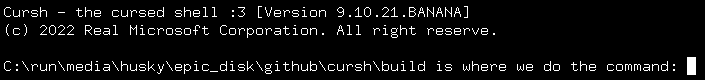

###### a cursh shell in action
# cursh
### the cursed shell :3
   
so one day i was wondering why no one has made a really funny cursed shell yet
so i opened clion cause i accidentally bought the whole jetbrains suite with
my mom's credit card and i started work on cursh!
  
#### ~~WARNING: PIPES ARE BROKEN RIGHT NOW DON'T USE THEM~~
#### IT'S OKAY PIPES ARE FIXED NOW I THINK
## how 2 install B)
ok so it's really simple! you can install cursh in 3 simple steps:
1. open up ur terminal (with the vastly worse shell you're currently using)
2. clone the repo (`git clone https://github.com/floppydiskette/cursh`)
3. cd into the directory and run `mkdir build && cd build && cmake .. && make`

now you can run `./cursh` and it'll run in the terminal!
 
idk if ur install will allow you to do this, but it'd be really funny if you ran 
`chsh -s <path to cursh>`  
also you may need the readline library and the ncurses library, although idk

## how 2 build
i literally just told you that wtf

## how 2 use
just check the book CURSH - THE ONLY SHELL THAT EXISTS! 
there should be a copy in the repo somewhere
~~but i'm working on getting it published to amazon rn so no worries~~
IT IS NOW AVAILABLE ON AMAZONG!!!!!
https://www.amazon.com/dp/B09T66C7HC :D

## copyright and licensing
i made this but you can use it too if you just credit me (floppydiskette)
this is because i released it under the MIT license!
